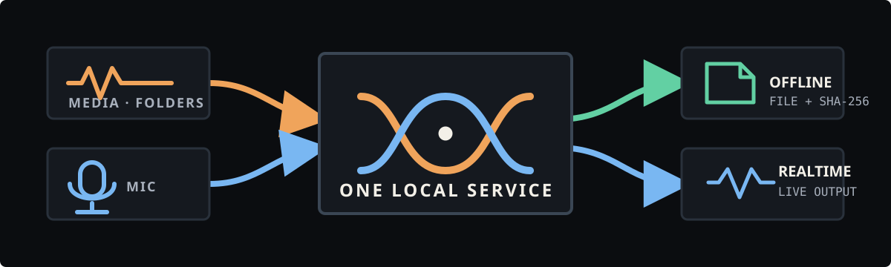

<!-- readme-header:start -->

<p align="center">
  
</p>

<h1 align="center">VoxWeave</h1>

<p align="center">
  <strong>Local offline media and live microphone RVC voice conversion for Windows.</strong>
</p>

<p align="center">
  <a href="./README.md">中文</a> · <strong>English</strong> · <a href="./README.ja.md">日本語</a> | <a href="./docs/ARCHITECTURE.md">文档</a> | <a href="./CONTRIBUTING.md">贡献</a> | <a href="https://github.com/CheshireMew/VoxWeave/issues">反馈</a>
</p>

<p align="center">
  <a href="https://x.com/0xCheshire" title="X"></a>
  <a href="https://t.me/CheshireBTC" title="Telegram"></a>
  <a href="https://blog.blacknico.com/" title="Blog"></a>
  <a href="https://blacknico.com/" title="Homepage"></a>
</p>

<p align="center">
  <a href="https://github.com/CheshireMew/VoxWeave/stargazers"></a>
  <a href="https://github.com/CheshireMew/VoxWeave/forks"></a>
  <a href="https://github.com/CheshireMew/VoxWeave/blob/main/LICENSE"></a>
</p>

<!-- readme-header:end -->

VoxWeave is a source-run RVC voice-conversion workstation for Windows. Give it local media, folders, or microphone audio and use the desktop app for previews, offline conversion, live voice conversion, and batch processing. Completed work, failures, and artifact locations remain visible in one task center.

<p align="center">
  
</p>

## Is VoxWeave the right fit?

| What you want to do | What VoxWeave delivers | Start here |
| --- | --- | --- |
| Convert speech, singing, or video | A new output without overwriting the source; video keeps its original streams and gains a converted audio track | Conversion Studio |
| Change a microphone voice live | Converted playback with speech, inference-time, level, and interruption status | Live Voice |
| Process folders or watch for new files | Cancellable, retryable, content-deduplicated tasks | Batch & Watch |
| Drive the workstation from a script or AI tool | A discoverable loopback HTTP/WebSocket contract and stable JSON results | CLI & API |

The validated platform is Windows 11 with NVIDIA CUDA. Linux and macOS boundaries exist in source but have not been validated on physical machines. This repository does not provide voice models, virtual audio devices, model training, GPT-SoVITS, an installer, or a bundled runtime.

## Quick start

### 1. Prepare the source environment

You need Python 3.12, Git, FFmpeg, and an NVIDIA CUDA GPU. Choose a data directory outside the source checkout. The Python environment, pip cache, temporary files, database, logs, downloads, and task artifacts all live there.

```powershell
git clone https://github.com/CheshireMew/VoxWeave.git
cd VoxWeave
.\scripts\bootstrap.ps1 -DataRoot D:\Tools\VoxWeave
```

If you already have the pinned-compatible RVC environment, provide it during bootstrap:

```powershell
.\scripts\bootstrap.ps1 `
  -DataRoot D:\Tools\VoxWeave `
  -RvcRoot E:\path\to\Retrieval-based-Voice-Conversion-WebUI `
  -RvcPython E:\path\to\Retrieval-based-Voice-Conversion-WebUI\.venv\Scripts\python.exe `
  -Ffmpeg D:\path\to\ffmpeg.exe `
  -Ffprobe D:\path\to\ffprobe.exe
```

`requirements.lock` is the validated Windows/Python 3.12 dependency set used by bootstrap and CI. The source checkout retains only an ignored `.voxweave.local.json` pointer to the selected data directory.

### 2. Start the desktop app

Double-click `VoxWeave.vbs` in the repository root for a windowless launch. To keep startup errors visible, run:

```powershell
.\scripts\run.ps1
```

`VoxWeave.bat` only forwards old shortcuts to `VoxWeave.vbs` and exits. After updating the source, run `.\scripts\voxweave.ps1 service stop` before starting again so the authenticated shutdown path can close the old service.

### 3. Install runtime components if needed

Start the desktop app first so the local service is available. Then submit the installation task from a new PowerShell window:

```powershell
.\scripts\voxweave.ps1 --json execute runtime.install --arguments '{}'
```

The task installs the pinned RVC source, an isolated Python environment, and required inference assets under the data directory. It does not download the optional source-separation weight whose redistribution license is unconfirmed. The WeSpeaker ONNX weight is installed under CC-BY-4.0. See [third-party notices](THIRD_PARTY_NOTICES.md).

### 4. Complete your first conversion

1. In Model Library, scan local folders or add a `.pth` file and optional `.index` that you are allowed to use.
2. Open Conversion Studio and choose the input, output location, and target model.
3. Create a preview, adjust pitch, F0, index rate, and related parameters, then start the full conversion.
4. Follow progress in Task Center and play or open the completed artifact.

VoxWeave does not overwrite existing output by default. Each task freezes the input, model, and index identity and verifies them again around execution. The result manifest records the final file and SHA-256, so a retry cannot silently use changed media or a replaced model.

## Three primary workflows

### Offline media

Conversion Studio accepts WAV, FLAC, MP3, MP4, and MKV. Speech modes can analyze speakers and convert selected speakers only. Singing mode can separate vocals and remix accompaniment when the user supplies the optional separation model. Up to four parameter sets can produce synchronized A/B previews.

Long audio is split at low-energy boundaries while one RVC model remains loaded. Video output stream-copies the original video and audio and adds a named converted audio track. The final file is decoded, manifested, and hashed before publication.

### Live microphone

Choose the Windows audio host, microphone, and playback device in Settings & Diagnostics, then select a model and parameters on Live Voice. Input and output must belong to the same host API. Headphones are recommended in continuous mode to prevent the playback signal from returning through the microphone.

Live Voice offers 0.25, 0.5, and 1.0 second latency budgets. Silero VAD and the configured microphone activation level decide when inference runs. Test mode captures and converts a complete utterance, then plays it after the user pauses, which is useful before continuous monitoring.

Live and offline work share one GPU boundary. A live session cannot start while an offline task is running. Tasks submitted during a live session stay queued and resume after the session stops.

### Batch and watched folders

A batch rule persists its input directory, output directory, model, and watch state. New files are queued only after their writes become stable. The output directory is excluded from input discovery, content SHA-256 prevents duplicate work, and one failed file does not erase the rest of the batch result.

Tasks can be cancelled, retried, and inspected in Task Center. VoxWeave never removes intermediate artifacts automatically. Use the confirmed archive action in Settings or submit the `storage.archive` long-running operation to release active storage.

## CLI and loopback API

The desktop app, CLI, and automation clients all use the same local service. Read the live operation list and schemas before invoking anything instead of copying an old contract into a script:

```powershell
.\scripts\voxweave.ps1 --json describe
.\scripts\voxweave.ps1 --json models
.\scripts\voxweave.ps1 --json execute runtime.inspect --arguments '{}'
```

Requests use `voxweave-control v1`. Long operations return a `task_id` immediately. Poll it with `task get` or consume the authenticated loopback WebSocket declared by the discovery file:

```powershell
.\scripts\voxweave.ps1 --json execute conversion.run --arguments '{
  "input":"D:\\media\\source.wav",
  "output":"D:\\media\\source-converted.wav",
  "model":"MODEL_ID_FROM_MODELS",
  "pitch":9,
  "f0":"rmvpe",
  "content_mode":"clean",
  "overwrite":false
}'

.\scripts\voxweave.ps1 --json task get TASK_ID
```

The service listens on a random `127.0.0.1` port. Its discovery file contains the PID, protocol version, and temporary token. Clients validate the process and handshake instead of trusting stale discovery data. See the [protocol reference](docs/PROTOCOL.md) for request, task, and WebSocket contracts.

## Data, models, and boundaries

- SQLite is the single state source for models, presets, tasks, batch rules, realtime sessions, events, artifacts, and archives.
- Structured JSON logs live under the data directory, rotate at 10 MB, and retain five files.
- Diagnostics include runtime, model, task, realtime, storage, and log summaries without embedding model or media contents.
- External models are indexed in place. VoxWeave hashes their weights and indexes without copying, renaming, or uploading them.
- URL and official-catalog models require a traceable source, exact size, SHA-256, and license before installation.

Voice models may imitate real people or characters. Users must obtain the permissions required from the voice subject, model author, and source-material rights holders and follow applicable laws and platform rules. See the [model source and licensing policy](MODEL_POLICY.md).

## Architecture and validation

The QML desktop app, CLI, and third-party clients enter the backend only through the authenticated loopback API. They do not scan models, write the task database, or call RVC directly. One serial worker handles offline tasks; realtime audio uses a separate resident process, and both coordinate through one GPU scheduler.

Read further:

- [Architecture and data boundaries](docs/ARCHITECTURE.md)
- [Protocol reference](docs/PROTOCOL.md)
- [Windows 0.1 validation record](docs/VALIDATION.md)
- [Public schemas](schemas/)
- [Changelog](CHANGELOG.md)

## Development

Create the source environment through Quick start, then run the Windows validation entry points:

```powershell
D:\Tools\VoxWeave\.venv\Scripts\python.exe -m ruff check .
D:\Tools\VoxWeave\.venv\Scripts\python.exe -m pytest
```

The real CUDA-chain script uses the running service for model resolution, task submission, RVC inference, and final media decoding:

```powershell
D:\Tools\VoxWeave\.venv\Scripts\python.exe scripts\verify_real_user_chain.py `
  --input D:\media\voice.wav `
  --model MODEL_ID_FROM_MODELS `
  --output-root D:\Tools\VoxWeave\validation\run
```

Read [CONTRIBUTING.md](CONTRIBUTING.md) before opening a pull request. The current project validates Windows only and does not produce an installer, archive, or bundled runtime.

## License and third-party components

VoxWeave source is licensed under [AGPL-3.0-only](LICENSE). RVC, Qt, FFmpeg, Python dependencies, inference components, and models retain their own terms. This repository distributes source only, not those runtimes or weights. See [third-party notices](THIRD_PARTY_NOTICES.md) for sources, pinned revisions, and redistribution boundaries.
